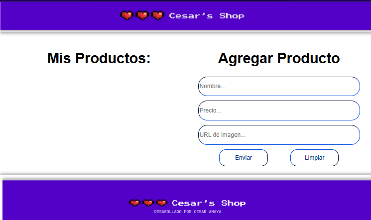
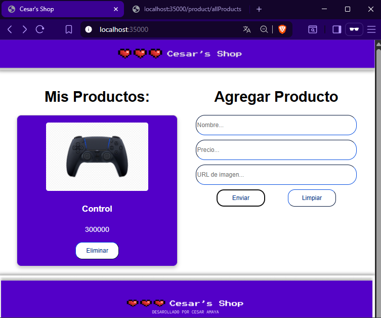
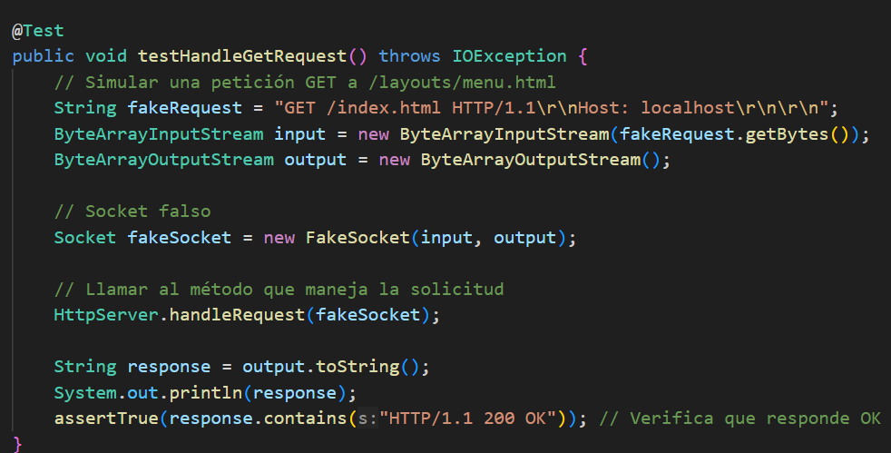
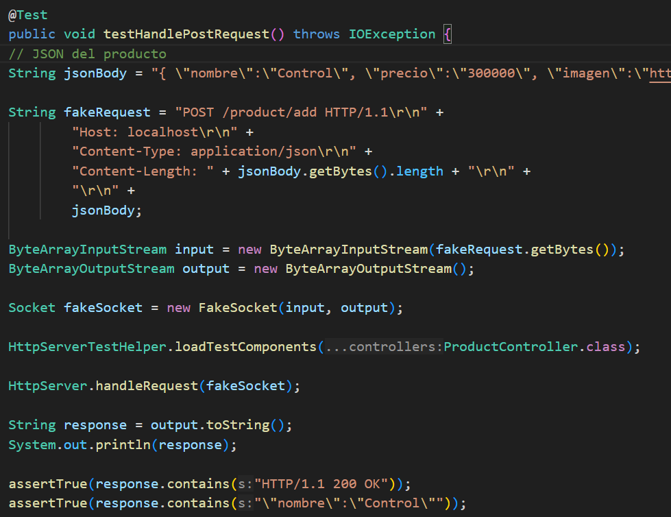
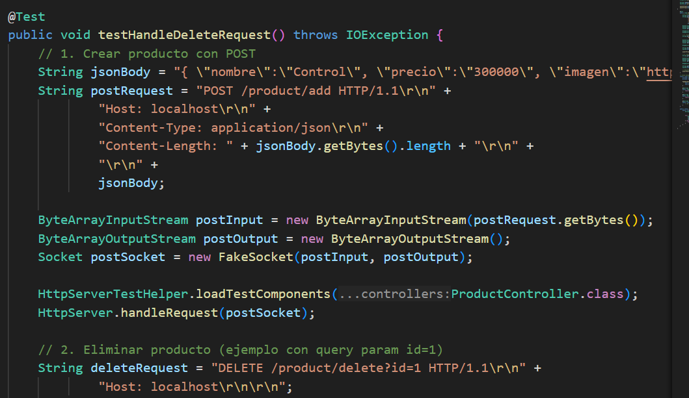

# Cesar's Shop - AREP_Lab03

Este proyecto implementa un servidor web HTTP en Java, que ha evolucionado progresivamente:

Fase 1: Servidor básico capaz de servir archivos estáticos (HTML, CSS, JS, imágenes). [GitHub](https://github.com/XxELIngexX/AREP-T1).

Fase 2: Extensión a un framework web ligero que permite definir servicios REST con lambdas (get("/ruta", ...)), manejar parámetros de consulta (req.getValues("param")) y especificar la ubicación de archivos estáticos. [GitHub](https://github.com/XxELIngexX/AREP-T2)

Fase 3 (actual): Transformación en un framework IoC inspirado en Spring Boot, soportando:

- POJOs con anotaciones como @RestController.
- Endpoints definidos con anotaciones:
    - @GetMapping("/ruta") para obtener recursos.
    -  @PostMapping("/ruta") para crear nuevos recursos.
    - @DeleteMapping("/ruta") para eliminar recursos.
- Manejo de parámetros de consulta con @RequestParam.
- Recepción de datos en formato JSON usando @RequestBody.


---

De esta forma, ahora se pueden construir aplicaciones web completas únicamente definiendo POJOs con anotaciones, sin necesidad de configurar manualmente rutas ni servicios.


# Requisitos previos
###  Java JDK 8 o superior
se pueden tener varias versiones de java JDK instaladas, pero para este proyecto es importante contar con JDK 8.

Puedes obtenerlo en el siguiente enlace:
[java JDK version 8](https://www.oracle.com/latam/java/technologies/javase/javase8-archive-downloads.html)

1. descargar el archivo compatible con el respectivo sistema operativo.

2. ejecutar el instalador y seguir todas las instrucciones.
    >Nota: se recomienda dejar todos los valores por defecto
3. Una vez instalado, busca en tu equipo **"Variables de entorno"** y ábrelo.  
4. En **Variables del sistema**, localiza la variable `JAVA_HOME` y selecciónala para **editar**.  
   - Si no existe, crea una nueva variable llamada `JAVA_HOME`.  
5. En el campo de **Valor de la variable**, coloca la ruta de instalación del JDK (por lo general):
    ```
    C:\Program Files\Java\
    ```

6. Guarda los cambios haciendo clic en **Aceptar** en todas las ventanas.  

¡Listo! El JDK quedará configurado para usarlo.

---

### Apache Maven  
Para compilar y gestionar dependencias del proyecto, es necesario tener instalado **Apache Maven**.  

Puedes obtenerlo en el siguiente enlace:  
[Descargar Apache Maven](https://maven.apache.org/download.cgi)  

1. Descarga la versión **binaria ZIP** compatible con tu sistema operativo.  
2. Extrae el contenido del archivo ZIP en una ubicación de tu preferencia.  
   > Ejemplo: `C:\apache-maven`  
3. Busca en tu equipo **"Variables de entorno"** y ábrelo.  
4. En **Variables del sistema**, localiza la variable `path` y selecciónala para **editar**.    
5. selecciona **nuevo**, coloca la ruta donde descomprimiste Maven seleccionando la carpeta bin:  
   > Ejemplo: `C:\apache-maven\bin` 
6. Guarda los cambios haciendo clic en **Aceptar** en todas las ventanas.  

#### Verificación de instalación  
Para confirmar que Maven está instalado correctamente, abre una terminal y ejecuta:  
```
mvn -version
```
Si todo está bien configurado, verás la versión de Maven, Java y el sistema operativo.

***
### Git (opcional)
Git es un sistema de control de versiones distribuido, necesario para manejar el código del proyecto.  
Podemos descargarlo desde el siguiente enlace oficial:  

[Descargar Git](https://git-scm.com/downloads)

#### Instalación:
1. Selecciona tu sistema operativo (Windows, macOS o Linux) y descarga el instalador correspondiente.
2. Ejecuta el instalador y sigue las instrucciones.
   - Se recomienda dejar las opciones por defecto, a menos que tengas una configuración específica.
3. Una vez instalado, abre una terminal o consola de comandos y verifica que Git está correctamente instalado ejecutando:
    ```
    git --version
    ```

# Primeros pasos - Implementacion en un entorno en vivo

Rutas Disponibles
- /hello
    - Saluda desde el controlador para confirmar que si usa correctamente las anotaciones

- /greeting?name="nombre"
    - endpoint definido en clase que dice "hola world" en caso de no tener parametros o "hola nombre"
- localhost:35000/ 
    - pagina de inicio
- /product/add
    - este endpoint gestiona la creacion de un producto, si se va a hacer una peticion POST desde postMan podriamos usar este json:
    
            {
                nombre : "Control",
                precio : 300000,
                imagen : "https://i.pinimg.com/originals/3c/41/72/3c4172c4a6ba0a4b8aef662f8197e059.png"
            }
- /product/allProducts
    la solicitud GET me devuelve un listado en formato JSON donde se listan todos los productos que se han creado

- /product/delete
    se envia como parametro el ID del elemento que se desea eliminar

1. **Obtener el proyecto**  
   Puedes obtener el proyecto de dos maneras:

   - **Descargando el .zip**  
     [Click aquí](https://github.com/XxELIngexX/AREP-T3), luego haz clic en el botón **"<> Código"** y selecciona **"Download ZIP"**.  
     Descomprime el archivo, abre una terminal y ubícate en el directorio del proyecto.

   - **Clonando el repositorio**  
     Abre una terminal y ejecuta:
     ```bash
     git clone https://github.com/XxELIngexX/AREP-T3.git
     ```
     ```
     cd AREP-T3
     ```
2. **Compilar el proyecto**
   Una vez en el directorio del proyecto, compila y descarga las dependencias con:
    ```
    mvn clean install
    ```

Esto generará los archivos compilados en la carpeta target/.


3. **Ejecutar el servidor** 
una vez compilado, ejecutar:
    ```
    java -cp target/classes edu.eci.arep.Main edu.eci.arep.examples.HelloController,edu.eci.arep.examples.GreetingController,edu.eci.arep.examples.ProductController
    ```

# Ejemplo de uso

Una vez que el servidor esté ejecutándose:

1. Abre tu navegador y visita ```localhost:350000/```:
Verás la página principal de **Cesar's Shop**.

    entraras un la UI del Rol de administrado, donde podras agregar productos para tu tienda Online  
    Esto realiza una solicitud `fetch` al servidor y carga el archivo `index.html` y lo s recursos que este utiliza como  los archivos de estilos `.css` y los archivos javaScript `.js` desde el backend.

    

2. Agregar un nuevo producto: 
puedes llenar el formulario con alguno de estos productos previamente seleccionados [productos](./docs/productos.txt)

    Haz clic en "Enviar" para enviar la informacion al backend y se creara el elemento que hemos creado.

    

### ¿Qué pasa en segundo plano?

Cuando envías el formulario, el navegador realiza una solicitud HTTP POST mediante fetch hacia el endpoint /product/add.

- Los datos ingresados en el formulario se convierten a formato JSON y se envían en el cuerpo de la petición.

- En el backend, el controlador recibe esta solicitud en un método anotado con @PostMapping("/product/add").

- El objeto enviado se mapea automáticamente a un POJO gracias a la anotación @RequestBody.

- Finalmente, gracias a la inyección de dependencias y las anotaciones como @RestController, el servidor HTTP gestiona todo el ciclo: recibe la petición, crea el objeto Product y lo guarda.

aqui podemos ver que anotaciones han sido definidas. o podemos encontrarlas en este [directorio](/src/main/java/edu/eci/arep/anotation/)


# Ejecutando las pruebas

El proyecto incluye un conjunto de **pruebas Automatizadas con JUnit** que validan el correcto funcionamiento de los endpoints y el framework IoC.

Para ejecutar todas las pruebas:
```
mvn test
```

1. Test de recursos estáticos (GET)

  
    - Simula una solicitud GET al servidor.

    - Comprueba que el servidor responde con HTTP/1.1 200 OK, indicando que el recurso fue encontrado y enviado correctamente.

    


2. Test de creación de producto (POST con @RequestBody)

    Se envía un JSON al endpoint /product/add y se valida que el servidor responda con el objeto creado:

    

3. Test de eliminación de producto (DELETE con @RequestParam)

    Se crea un producto y luego se elimina con un DELETE /product/delete?id=1.
    Finalmente, se valida que el producto ya no está en la lista:

    

podemos explorar ls pruebas mas a fondo el el [directorio](./src/test/java/edu/eci/arep/HttpServerTest.java)


## Implementación

Este proyecto se puede ejecutar tanto en un entorno local como en un servidor remoto.  
En un **entorno local**, siga los pasos de la sección ["Primeros pasos"](#primeros-pasos).  

Para un **entorno en vivo**:
1. Compile el proyecto (`mvn clean install`) y copie el `.jar` generado al servidor.
2. Ejecútelo con:
   ```bash
   java -cp target/classes edu.eci.arep.Main edu.eci.arep.examples.HelloController,edu.eci.arep.examples.GreetingController,edu.eci.arep.examples.ProductController
3. Asegúrese de que el puerto 35000 esté abierto en el firewall.


5. acceder a http://<IP_DEL_SERVIDOR>:35000

## Construido con
* [Java](https://www.oracle.com/java/) - Lenguaje principal
* [Maven](https://maven.apache.org/) - Gestión de dependencias
* HTML, CSS y JavaScript - Interfaz de usuario

## Autores
* **Cesar David Amaya Gomez** - Autor principal

## Licencia

Este proyecto está licenciado bajo la Licencia Pública General de GNU, versión 3 (GPLv3).  
Puedes ver una copia completa en el archivo [LICENSE](LICENSE) de este repositorio o en  
[https://www.gnu.org/licenses/gpl-3.0.html](https://www.gnu.org/licenses/gpl-3.0.html).


